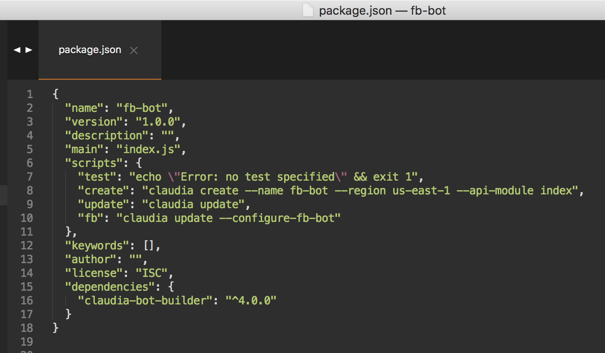

# FB Messenger Chatbot using Claudia.js, AWS & Node.js

- Links: Facebook Template Message builder (https://github.com/claudiajs/claudia-bot-builder/blob/master/docs/FB_TEMPLATE_MESSAGE_BUILDER.md)

## Step 1: Installations 

- Install claudia as a global utility: npm install claudia -g
- Once the installation is complete, check to see if it is installed correctly: claudia --version

## Step 2: AWS Credentials

- Get credentials from AWS account

- Create .aws/credentials file

## Step 3: Create Facebook Page

- Go to https://www.facebook.com/pages/create
- Add a button

- Select send message

## Step 4: Setup/Create Project

- Create folder to store project: mkdir fb-bot
- Create a ‘package.json’ file in the folder: npm init -y
- Add claudia bot builder dependencies: npm install claudia-bot-builder -S
- Create and open the index.js file
- Use Claudia.js’s Facebook Template Message builder to generate messages for the bot 
- Set up AWS lambda and API gateway using Claudia.js 
	- Deploy the bot: claudia create --name fb-bot --region us-east-1 --api-module index 
	- Configure the bot: claudia update --configure-fb-bot
	- claudia update
	- Add the commands above to package.json
	 
		- npm run create
		- npm run fb
		- npm run update 
	- Copy the webhook and verify token and paste it under the ‘Webhooks’ section of Facebook messenger
	

## Step 5: Create Facebook App

- Go to https://developers.facebook.com/
- Create a new App

- Select ‘Messenger’ and click on ‘Set Up’

- Under the ‘Webhooks’ section and paste the Webhook url and token from the previous step

- Under the ‘Token Generation’ section, select the page where you want to deploy the chat bot

- Facebook app secret

- Test

